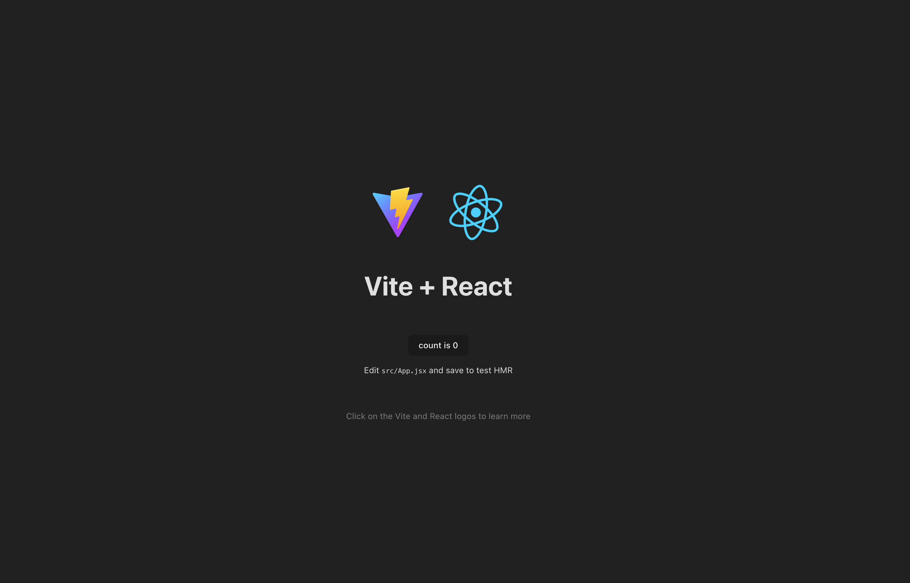
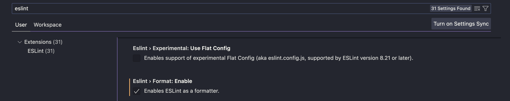

# Desarrollo Web con React: Tu primer app

Por Mike Nieva. Impulsado por "Coursera Guide Projects".

## Tabla de contenidos

- [](README.md)

## Introducción

Te doy la bienvenida a la construcción de un proyecto web en React, utilizando herramientas modernas en Frontend.

Antes de comenzar, una de mis recomnedaciones es realizar todo el proyecto guiado directamente, de manera práctica, y postiormente regresar a esta sección para leer con calma los conceptos.

Recuerda que más allá de memorizar, es entender por qué se está utilizando cada tecnología y de qué forma la estamos implementando para alcanzar nuestros objetivos.

Una vez terminado el proyecto guiado, así como sus respectivas prácticas, inténtalo nuevamente en tu computadora para confirmar que puedes implementarlo fuera del entorno del navegador.

Las tecnologías que estaremos implementando serán:

- App
  - **React.** Librería que nos permitirá desarrollar componentes
  - **React Router.**
  - **TailwindCSS.**
  - **Eslint.**
  - **Prettier**
  - **Husky.**
- Compilador
  - **Vite**

## Generar un proyecto en React con Vite

### Objetivo

Vamos a comenzar a desarrollar nuestro proyecto web en React.

Este será nuestro resultado final:

**Primer sección. Inicio.**


**Segunda sección. Contacto.**


### Configuración inicial

Necesitamos primero crear un proyecto web con Vite, utilizando en terminal:

```shell
$ npm create vite@latest
```

Al momento de ejecutar este comando, recibirás diferentes instrucciones para generarlo.

- **Project name**. El nombre de tu proyecto.
- **Select a Framework**. La herramienta a utilizar, en este caso, React.
- **Select a variatn**. Usaremos JavaScript. Hay otras opciones para usar TypeScript, el cual es un lenguaje diferente con un enfoque en tipado. Te recomiendo conocerlo conforme vayas obteniendo más experiencia y portafolio.

Una vez hecho esto, abrimos el proyecto desde Visual Studio Code con "Open folder".

Y, nuevamente en terminal, generamos los siguientes comandos para levantar el proyecto:

```shell
$ npm install
$ npm run dev
```

- El primer comando `npm install` realiza las instalaciones de todas las dependencias del proyecto, es decir, todas las librerías desarrolladas por la comunidad para comenzar a construir más rápido y no tengas que crear todo desde cero.

- El segundo comando `npm run dev` arranca el proyecto y podremos verlo directamente en pantalla.

Ejecuta ambas, y luego de ello, podremos empezar a trabajar.

Esto te aparecerá en terminal:

```shell
  VITE v4.1.4  ready in 220 ms

  ➜  Local:   http://localhost:5173/
  ➜  Network: use --host to expose
  ➜  press h to show help
```

Y, esto, en tu navegador, en `http://localhost:5173`:



Al haber instalado y usado los comandos con Vite, estamos realizando dos actividades:

- Generar un servidor de desarrollo.
- Contar con un comando de compliación que empaquetará el código y estará altamente optimizado.

Una vez realizado el proceso de creación, pasemos a la instalación de dependencias.

Aunque ya habiamos hecho esto anteriormente, solo instalamos las dependencias necesarias para trabajar un proyecto base, pero necesitaremos unas más para construir con mayor agilidad.

Sitúate en la terminal y presiona `CTRL + C`. Esto detendrá el servidor y ya no podrás acceder a él.

### Configuración de TailwindCSS

TailwindCSS es una herramienta que nos permite trabajar estilos directamente en los componentes. Es bastante útil. Dependiendo del estilo del proyecto, puede que exista o no, para el manejo del diseño y hojas de estilo del proyecto web, pero, en este caso, lo usaremos.

Escribe a continuación este comando en tu terminal:

```shell
$ npm install -D tailwindcss @tailwindcss/forms autoprefixer postcss
```

- **tailwindcss**. Esta es la librería principal de TailwindCSS que incluye todas las configuraciones.
- **postcss**. Es una herramienta que nos permite transforar estilos con plugins de JS. Es decir, internamente implementa lógica de programación como variables y "mixins", audita el código CSS, entre otras actividades. Se incluye como parte dependiente para TailwindCSS.
- **autoprefixer**. Es una extensión ("plugin") de `postcss`, el cual incluye el uso de prefijos como arrobas (`@`).
- **@tailwindcss/forms**. Es un plugin diseñado para Tailwind CSS, el cual proporciona estilos prediseñados para los elementos de formulario HTML, como inputs, selects y botones.

Una vez realizada las instalaciones, avancemos a trabajar con la instalación de un archivo de configuración para TailwindCSS, el cual, desde ahí, podremos coordinar las diferentes personalizaciones para nuestro proyecto.

En terminal:

```shell
npx tailwindcss init -p
```

Se generarán dos archivos: `taiwlindconfig.cjs`y `postcss.config.css`.

Trabajaremos únicamente con el de Tailwind.

Usaremos esta configuración:

```cjs
/** @type {import('tailwindcss').Config} */
module.exports = {
  content: ['./index.html', './src/**/*.{js,ts,jsx,tsx}'],
  theme: {
    extend: {
      colors: {
        'brand-yellow': '#fed685',
        'brand-blue': '#3969B3',
        'brand-light-blue': '#85B5FF',
      },
    },
  },
  plugins: [require('@tailwindcss/forms')],
}
```

Este archivo tiene diferentes propiedades, escrito en formato `.cjs` que significa CommonJS.
Enfoquémonos en cómo podemos personalizar y extender los plugins para adaptarlo a las necesidades específicas de nuestro proyecto.

- **content**. Es una propiedad que especifica los archivos HTML, JavaScript y TypeScript donde se utilizará Tailwind para generar los estilos CSS.
- **theme**. Es una propiedad donde se establece la extensión de personalización. Puntualmente, en este caso, trabajaremos con los colores.
- **plugins**. Es una propiedad que permite realizar extensión de librerías a Tailwind. En este caso, estamos integrando la librería que instalamos relacionada con formularios.

Una vez hecho esto, nos vamos al archivo `index.css` e integramos en el punto más alto del archivo este código:

```css
@tailwind base;
@tailwind components;
@tailwind utilities;
```

Hacemos un cambio en el archivo `App.jsx`:

`./src/App..js`

```jsx
import './App.css'

function App() {
  return (
    <div className="App">
      <h1 className="text-3xl font-bold underline">Hello world!</h1>
    </div>
  )
}

export default App
```

Observa que estamos escribiendo en la etiqueta `<h1>`una propiedad llamada className y dentro, un conjunto de estilos. Estos estilos se interpretan de manera universal dentro de Tailwind y puedes generar los propios como gustes.

Por ejemplo, observa que tenemos `underline` como uno de los valores, el cual significa que está subrayando el texto interno.

El resultado debería ser esta imagen:


Listo, ya podemos a empezar a trabajar con Tailwind.

### Instalación de guía de estilos

Cada vez que comiences un proyecto, es importante estableces cuáles van a ser las reglas que se deberán cumplir en tu proyecto. Puede ser tan estricto o tan flexible como tú quieras.

Usaremos `eslint`el cual es una herramienta de análisis de código para JavaScript. Nos ayudará a identificar y reportar patrones problemáticos, como error de sintaxis, vulnerabilidades de seguridad o incluso, estilo.

Adicionalmente, `eslint`, así como Tailwind, tiene también muchos plugins que permiten extender las reglas.

Comenzaremos la instalación de `eslint` dentro del proyecto de manera local para establecer nuestras reglas y configuraciones:

```shell
$ npm init @eslint/config
```

Nos harán diversas preguntas:

```
How would you like to use ESLint?
"To check syntax and find problems".

What type of modules does your project use?
JavaScript modules (import/export)

Which framework does your project use?
React

Does your project use TypeScript?
"No"

Where does your code run?
Browser

What format do you want your config file to be in?
JSON

Una vez hecho esto, te pedirá realizar la instalación de la  dependencia
`eslint-plugin-react@latest` y `eslint@latest`. Seleccionamos: "Yes".

Which package manager do you want to use?
"npm"
```

Luego, de esto, instalaremos su extensión:

- Eslint - ESLint

NOTA: Es importante que tengas actualizado VSC al menos a partir de v17.

Notarás que te aparecerá un error en `App.jsx`. Esto se debe a que estamos inclumpiendo la regla de que el archivo debe tener importando `React`.

En caso de que no aparezca ningún error, abrimos Settings, y nos dirigimos a la sección de habilitar `eslint`. La encontrarás bajo esta opción:


Si tampoco aparece la opción, verifica que tu Visual Studio Code se encuentre en la versión 17 mínimo.

Regresando al error, la forma en cómo quitamos, sería colocando la importación.

```jsx
import React from 'react'
import './App.css'

function App() {
  return (
    <div className="App">
      <h1 className="text-3xl font-bold underline">Hello world!</h1>
    </div>
  )
}

export default App
```

Una vez hecho eso, el error desaparece.

Esto se debe a que `eslint` va a vigilar que todo el proyecto siga unas reglas y prácticas específicas.

Sin embargo, nosotros jugaremos con una versión de React actualizada, y por lo tanto, solo agregaremos una extensión llamada `plugin:react/jsx-runtime` en el área de extensiones dentro del archivo de `.eslintrc.json`.

```json
  "extends": [
    "plugin:react/recommended",
    "standard",
    "plugin:react/jsx-runtime",
  ],

```

Y con esto, podremos regresar a como teníamos el archivo anteriormente.

```jsx
import React from 'react'
import './App.css'

function App() {
  return (
    <div className="App">
      <h1 className="text-3xl font-bold underline">Hello world!</h1>
    </div>
  )
}

export default App
```

Con esta configuración, el archivo `App.jsx` te pide que ya no incluyas la importación de React, por lo tanto, puedes quitarla sin complicación.

Puedes conocer cada regla en la documentación de `eslint`. Lo importante es que aquí estamos estableciendo qué es válido y qué no. Y al mismo tiempo, instalamos librerías adicionales que nos permiten generar reglas más específicas.

### Configuración de formato de código

Una parte son las reglas del código y otra es el formato del mismo.

`eslint` se enfoca en el análisis estático de código para encontrar errores y problemas relacionados con la calidad.

`prettier` es una herramienta que se utiliza para mantener el estilo consistente en todo el código. Que sea más legible y fácil de mantener.

Para ello, generamos la instalación en terminal:

```shell
$ npm install --save-dev --save-exact prettier
```

Generamos dos archivos: `.prettierrc.json` y `.prettierignore`.

Dentro de `.prettierrc.json`, integramos el código:

```json
{
  "semi": false,
  "singleQuote": true
}
```

Perfecto. La configuración está terminada y es momento de que comencemos a trabajar en la aplicación en la siguiente sección.
